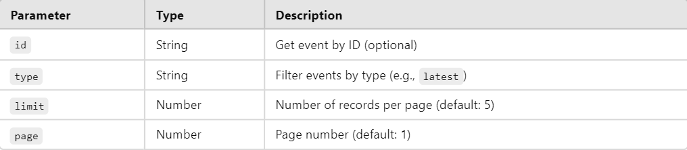
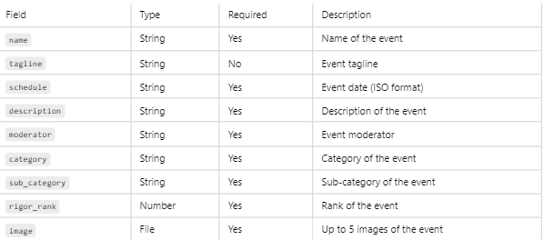

# **Event Management API**

## Overview

The Nudge API allows users to create, update, delete, and retrieve "nudges" for events. A "nudge" is a form of reminder or notification associated with an event. Users can tag an event, provide a title, upload a cover image, set a time for when the nudge should be sent, provide a description, and include an icon with a one-line invitation.


**Installation**
1. Clone the repository:
```
git clone <repository_url>
```

2. Install dependencies:
```
npm install
```

3. Start the server:
```
npm start
```

## Data Model
**Nudge/Event Object**

```
{
  "id": "string",                  // Unique identifier for the nudge
  "tag": "string",                 // Tag for the associated event/article
  "title": "string",               // Title of the nudge (max 60 characters)
  "image_url": "string",           // URL of the uploaded cover image
  "scheduled_date": "string",      // Date for the nudge (format: dd/mm/yyyy)
  "start_time": "string",          // Start time for the nudge (format: hh:mm)
  "end_time": "string",            // End time for the nudge (format: hh:mm)
  "description": "string",         // Description of the nudge
  "icon": "string",                // Icon associated with the minimized nudge
  "invitation": "string"           // One-line invitation (e.g., "Check out this workshop!")
}

```


## API Endpoints

### 1. Get Events
```
GET /events
```

> Query Parameters:
>
> 


Response:

-```200 OK:``` Event(s) retrieved successfully.

-```404 Not Found:``` No event found.

-```400 Bad Request:``` Invalid query parameters.

-```500 Internal Server Error:``` Error retrieving events.

### 2. Create Event
```
POST /events
```
> Request Body (multipart/form-data):
> 
> 

Response:

-```200 Created:``` Event created successfully.

-```400 Bad Request:``` Missing required fields or no image uploaded.

-```500 Internal Server Error:``` Error creating event.

### 3. Update Event
Endpoint:
```
PUT /events/:id
```
Request Body (multipart/form-data): (Same fields as Create Event)

Response:

-```200 Ok:```  Event updated successfully.

-```404 Not Found:``` : Event not found.

-```400 Bad Request:``` Missing required fields or invalid ID.

-```500 Internal Server Error:``` Error updating event.

### 4. Delete Event
Endpoint:
```
DELETE /events/:id
```
Response:

-```200 OK:``` Event deleted successfully.

-```404 Not Found:``` Event not found.

-```400 Bad Request:``` Invalid ID.

-```500 Internal Server Error:``` Error deleting event.

## Error Handling

Error Handling
```
{
  "error": "Error message",
  "details": "Detailed error information"
}
```

## Database

-MongoDB is used as the database.

-Collection: ```events```

## Technologies Used

-Node.js

-Express.js

-MongoDB

-Multer (for file uploads)
